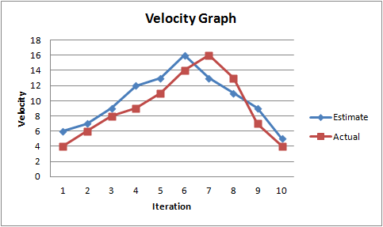
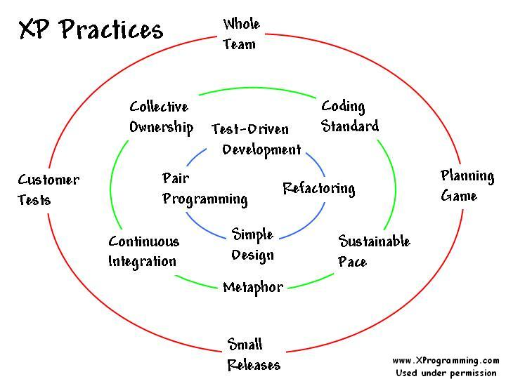

# Introduzione ad Agile

Il principio Agile trae probabilmente la sua origine 50.000 anni fa, quando gli esseri umani decisero di collaborare a obiettivi intermedi e di misurare i progressi al raggiungimento di ciascuno di essi. Nello sviluppo software il principio Agile può essere fatto risalire ad Alan Turing, quando, i suoi primi programmi software, venivano sviluppati a piccoli passi con frequenti verifiche svolte a mano. Agile non era però l'unico principio in gioco. In realtà, era in competizione con un'altra metodologia dal nome: **Scientific Management**. Essa si basava su un approccio _top-down_, dove i manager impiegavano tecniche scientifiche per determinare le migliori procedure per raggiungere un certo obiettivo e poi ordinavano ai sottoposti di seguire il loro piano alla lettera. Negli anni Settanta queste due tecniche erano l'uno l'opposto dell'altra. La tecnica pre-Agile prevedeva brevi passi reattivi che venivano misurati e raffinati per convergere verso un buon risultato. La tecnica Scientific Management differiva l'azione solo dopo un'approfondita analisi e la preparazione di un piano dettagliato. La prima tecnica funzionava bene per qui progetti che potevano contare su bassi costi di modifica e che risolvevano problemi parzialmente definiti. La tecnica Scientific Management era più adatta a progetti con elevati costi di modifica e che dovevano risolvere problemi ben definiti e con obiettivi specifici. Un po' per caso, negli anni Settanta ebbe successo per la maggiore la tecnica Scientific Management, poi ribattezzata in "**Waterfall**" (sviluppo a cascata).

Il processo Waterfall venne adottato per quasi trent'anni. Il suo concetto di analisi e progettazione minuziosa aveva affascinato un'enorme schiera di sviluppatori e aziende, ma nessuno di questi si era accorto, fino alla fine degli anni Novanta, che questo sistema era la principale causa dello sforamento delle _deadline_. A fine anni Novanta, Robert Martin, grazie alla collaborazione di Kent Beck (ideatore dell'Extreme Programming), aveva intuito che tale processo non si adattava bene allo sviluppo software, così, insieme a un gruppo di altri illustri sviluppatori, si riunirono a Snowbird per dare vita a quello che tutti oggi noi conosciamo come "**Manifesto Agile"**.

### Snowbird

Fu a Snowbird che diciassette importati sviluppatori, tra questi ricordiamo Kent Beck, Alistair Cockburn, Ward Cunningham, Martin Fowler, Andrew Hunt, Dave Thomas, Robert C. Martin, si riunirono in un meeting di due giorni per dare vita a quello che oggi tutti noi conosciamo come "**Manifesto Agile"**. Non mi soffermerò sulla storia di chi ha avuto per primo l'idea sui principi Agile, quello su cui mi soffermerei sono le conclusioni che quel meeting ha portato. Quattro righe che riassumono perfettamente il senso del Manifesto:

* _Individui e interazioni_ più che processi e strumenti
* _Software funzionante_ più che ampia documentazione
* _Collaborazione con il cliente_ più che negoziazioni sui contratti
* _Reattività ai cambiamenti_ più che aderenza a un piano

Da queste quattro righe si diede vita a un cambiamento epocale a quello che sarebbe stato lo sviluppo software negli anni avvenire.

### Panoramica su Agile

Quasi tutti i progetti software sono vincolati a obbedire a un inevitabile compromesso della gestione dei progetti, la cosiddetta _Iron Cross_: buono, veloce, economico e finito. Tre di queste quattro qualità possono essere raggiunte, ma non riuscirete mai a raggiungere anche la quarta. Potete avere un progetto buono, veloce ed economico, ma non avrà mai fine. Così come potete avere un progetto finito, economico e veloce, ma non sarà affatto buono. Un buon manager punta a un progetto che sia sufficientemente buono, economico, veloce e che sia finito quanto è necessario. È proprio questo il tipo di gestione che Agile tenta di perseguire.

#### Grafici sulla parete

Lo scopo principale di Agile è quello di **fornire dati.** Grazie ai dati forniti è possibile prevedere in che direzione andrà un progetto e se la deadline verrà probabilmente raggiunta. Date un'occhiata a questi due grafici

Il primo grafico si chiama **Velocity Graph** e indica a che velocità sta procedendo il completamento dei task. Nell'asse delle ascisse abbiamo il numero d'iterazioni (i cosiddetti _sprint_), mentre nell'asse delle ordinate la velocity, ovvero il numero di task completati per quella iterazione. Analizzando questo grafico possiamo sapere quanti task mediamente riesce a portare a termine il team a ogni iterazione.

Il secondo grafico si chiama **Burn Down Graph** e indica, a ogni iterazione, quanti task mancano al team per completare il progetto. Come si può notare il grafico presenta punti di risalita, questo avviene perché il progetto è in continua evoluzione e magari nuove funzionalità vengono aggiunge in corso d'opera o gli sviluppatori hanno riscontrato la necessità di riconsiderare il lavoro svolto.

Entrambi i grafici ci consentono di conoscere l'andamento del progetto, in modo tale da decidere come impostare i coefficienti di Iron Cross e condurre il progetto verso il miglior risultato possibile. **Lo sviluppo Agile è un approccio guidato dai feedback**.

#### La prima cosa da sapere

Prima ancora di sviluppare un progetto, prima ancora di analizzare e conoscere i requisiti, la prima informazione che si conosce di un progetto è la famosa Data di Scadenza. Perché questo? Perché la data viene fissata per motivi commerciali e spesso non può essere cambiata. Allo stesso tempo, i requisiti sono in continuo mutamento e non possono essere fissati. Questo perché i clienti stessi non sanno davvero quello che vogliono. Conoscono vagamente il problema che vogliono risolvere, ma tradurre questo in requisiti per un sistema non è affatto banale. Pertanto, che ci piaccia o meno, i requisiti vengono costantemente rivalutati. Per questo motivo l'approccio Waterfall, che si basa su lunghe fasi di analisi e progettazione, ha portato al fallimento numerosi progetti software. Un'analisi e una progettazione approfondita non ci forniscono dati concreti sullo stato di avanzamento di un progetto. Solo unendo a ogni iterazione le tre fasi di: analisi, progettazione e implementazione possiamo avere dei dati che ci diano un'idea sul raggiungimento della deadline.

### L'approccio Agile

Un progetto Agile inizia anch'esso con la fase di analisi, ma questa analisi non termina mai. Questo perché un progetto cambia di continuo: nuove funzionalità vengono aggiunte, altre vengono rivalutate e altre eliminate. In Agile il tempo tra la data d'inizio progetto e la data di fine viene suddiviso in regolari incrementi chiamati **iterazioni** o **sprint**. Le dimensioni di un'iterazione sono in genere di una o due settimane (preferibilmente una per evitare che troppe cose vadano storte).

La prima iterazione, talvolta chiamata _iterazione zero_, viene utilizzata per definire un breve elenco di funzionalità, o _stories_, da sviluppare, definire l'ambiente di sviluppo, stimare le stories e collocarle per le prossime prime iterazioni. Questo processo di scrittura delle stories, la loro valutazione, pianificazione e progettazione non termina mai. Questo processo prende il nome di _Esplorazione_. Ogni iterazione del progetto conterrà sempre una quota di analisi, progettazione e implementazione.

#### Agile produce dati

L'iterazione uno inizia con una stima di quante storie verranno completate nell'arco di quella settimana. In questa iterazione, molto probabilmente, il team di sviluppo non riuscirà a completare tutte le storie programmate, questo perché per uno sviluppatore è praticamente impossibile stimare con assoluta certezza quanto tempo impiegherà per portare a termine il lavoro. Non disperatevi, questa prima iterazione ci ha comunque fornito dei _dati reali_ che ci aiuteranno a capire la _Velocity_ di un progetto, ovvero quante storie mediamente il team riesce a completare nel giro di un'iterazione. Grazie a questi dati sarà possibile "aggiustare" il piano iniziale e calcolare una nuova data finale per il progetto. Questo primo dato probabilmente sarà molto deludente. Infatti, prima di avere dei dati più precisi sulla Velocity di un progetto, dovremo svolgere almeno quattro o cinque iterazioni, così da sapere quante storie mediamente riesce a completare un team durante un'iterazione.

Questo è il principio Agile, un approccio che consente di fornire grandi quantità di _dati oggettivi_. Alcuni ritengono che Agile significhi andare velocemente. Non è così. Agile significa sapere, il più presto possibile, quanto siamo nei guai, così da gestire la situazione prima che sia troppo tardi.

#### Gestire la Iron Cross

Ritorniamo alla Iron Cross di gestione del progetto: buono, veloce, economico e finito. Sulla base dei dati prodotti, un buon manager deve determinare quanto buono, veloce, economico e finito deve essere un progetto. I manager possono farlo apportando modifiche all'ampiezza, al calendario dei lavori, al personale e alla qualità.

#### Modificare il calendario dei lavori

Un modo per far fronte il ritardo di un progetto è quello di chiedere ai committenti di allungare la data di fine lavori. Solitamente la risposta sarà negativa, in quanto la data viene fissata per motivi commerciali, ma, possibilmente, lo slittamento di un mese non crea un grosso problema a livello commerciale. Questo, quindi, potrebbe essere un buon compromesso per completare con successo il progetto.

#### Aggiungere personale

Un'altra strategia che spesso viene adottata per aumentare la velocità è l'aggiunta di personale. Tuttavia, per le prime settimane, l'aggiunta di nuova forza lavoro provocherà un aumento del ritardo. Questo avviene perché i nuovi arrivati, inizialmente, non conoscono il funzionamento del progetto e pertanto avranno bisogno di supporto da parte dei più esperti. Ciò avviene nelle prime due/tre settimane, dalla quarta in poi il team sarà nuovamente più produttivo.

#### Ridurre la qualità

Spesso si pensa che riducendo la qualità di un progetto si va più veloci. Niente di più sbagliato. Ciò che "fa schifo" ci dà una falsa illusione di velocità, in quanto, presto o tardi, porterà il progetto a dover rallentare bruscamente. Una semplice modifica costerà sudore e fatica all'intero team. La qualità è, pertanto, una delle caratteristiche che deve rimanere sempre alta all'interno di un progetto.

#### Cambiare l'ampiezza

Un altro modo per far fronte alla crisi di progetto è quello di rimuovere alcune delle funzionalità richieste. Quasi sicuramente per i committenti è tutto assolutamente indispensabile, ma sappiamo bene che in ogni progetto non tutte le funzionalità sono fondamentali per il _day one_. All'inizio sarà dura convincerli di ciò, ma forzando un po' la mano e mostrando chiarimenti i dati finora raccolti, alla fine dovranno necessariamente convincersi della dura realtà dei fatti.

#### L'ordine dei valori

A volte capita che i committenti trovano superflua una funzionalità che abbiamo già implementato. Un modo per evitare questo consiste nel chiedere ai clienti, all'inizio di ogni iterazione, quale funzionalità dobbiamo implementare per prima, così da evitare l'aggiunta di funzioni non necessarie per il _day one_.

### Il "Cerchio della vita"

Il grafico sopra, cui si è soliti chiamare con il nome il _Cerchio della vita_, mostra l'insieme delle pratiche **dell'Extreme Programming**. L'XP, il cui ideatore è Kent Beck, definisce un insieme di processi che stanno alla base del principio Agile.

Il Cerchio della vita è suddiviso in tre anelli. L'anello più esterno mostra le pratiche XP rivolte alla società esterna e indica i principi in base ai quali l'azienda e il team di sviluppo software gestiscono il progetto.

* _Incontri di pianificazione ("Planning Game")_: ci dice come suddividere un progetto in funzionalità, storie e task e come pianificare, stimare e valutare le priorità di queste funzionalità.
* _Piccole Release ("Small Releases")_: esorta il team a lavorare in piccoli incrementi.
* _Test di accettazione ("Customer Tests")_: fornisce la definizione di "finito" per le funzionalità, le storie e i task.
* _Intero Team ("Whole Team")_: fornisce il concetto che un team di sviluppo software è composto da molte funzioni, programmatori, tester, manager, che collaborano per raggiungere lo stesso obiettivo.

L'anello centrale del Cerchio della vita presenta le pratiche mediante il quale il team di sviluppo comunica internamente e si gestisce

* _Passo sostenibile ("Sustainable Pace")_: è la pratica che impedisce a un team di bruciare risorse ed energie troppo rapidamente
* _Proprietà collettiva ("Collective Ownership")_: garantisce che il team non divida il progetto in un insieme di silos di competenze.
* _Integrazione continua ("Continuous Integration")_: mantiene il team concentrato su una frequente chiusura del ciclo di feedback.
* _Metafora ("Metaphor")_: è la pratica che crea e promuove il linguaggio che l'intero team utilizza all'interno del progetto.

L'anello più interno del Cerchio della vita rappresenta le pratiche di natura tecnica utilizzate dai programmatori

* _Programmazione a coppie ("Pair programming")_: è la pratica che permette al team tecnico di condividere la conoscenza.
* _Simple Design_: è la pratica che guida il team a semplificare il progetto.
* _Refactoring_: incoraggia un continuo miglioramento e raffinamento del codice.
* _Test-Driven Development_: è la misura impiegata dal team per procedere rapidamente mantenendo alta la qualità.

Queste pratiche si allineano perfettamente agli obiettivi di Agile:

* **Individui e interazioni più che processi e strumenti:** _Intero team, Metafora, Proprietà collettiva, Pair programming, Passo sostenibile_
* **Software funzionante più che ampia documentazione:** _Test di accettazione, Test-Driven Development, Simple Design, Refactoring, Integrazione continua_
* **Collaborazione con il cliente più che negoziazioni sui contratti:** _Piccole release, Incontri di pianificazione, Test di accettazione, Metafora_
* **Reattività ai cambiamenti più che aderenza a un piano:** _Piccole release, Incontri di pianificazione, Passo sostenibile, Test-Driven Development, Refactoring, Test di accettazione_

### Conclusioni

Abbiamo visto una panoramica della metodologia Agile. Esso è un processo mediante il quale un progetto viene suddiviso in iterazioni. Ogni iterazione viene misurata e utilizzata per valutare continuamente il calendario dei lavori. Le nuove funzionalità vengono implementate secondo il loro valore commerciale in modo che per prime vengono implementate le cose più importanti. La qualità deve essere mantenuta sempre alta. Il calendario dei lavori viene gestito principalmente intervenendo sull'ampiezza.
